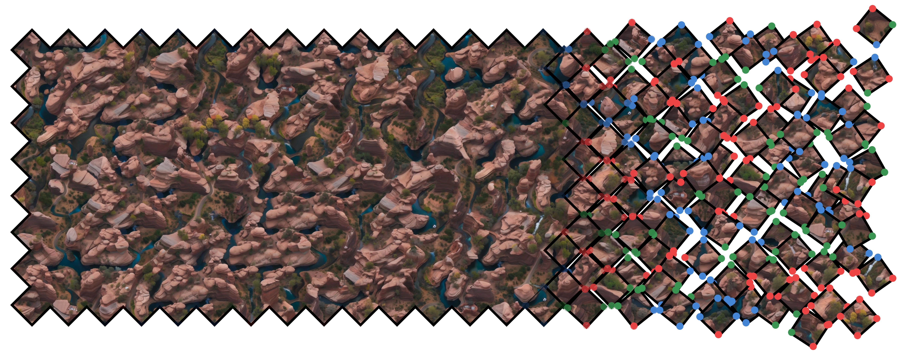
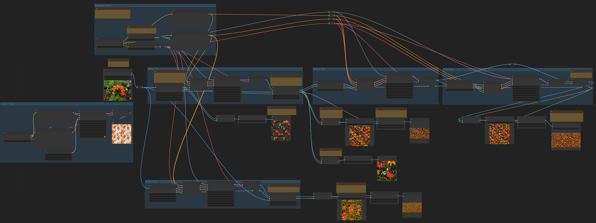

# Content-aware Tile Generation using Exterior Boundary Inpaintings <br> [[Paper](https://bin.samsartor.com/content_aware_tiles.pdf)] [[Website](https://samsartor.com/content-aware-tiles)] [[Supplemental](https://bin.samsartor.com/content_aware_tile_supplemental/index.html)]



We present a novel and flexible learning-based method for generating
tileable image sets.  Our method goes beyond simple self-tiling,
supporting sets of mutually tileable images that exhibit a high
degree of diversity.  To promote diversity we decouple structure
from content by foregoing explicit copying of patches from an
exemplar image.  Instead we leverage the prior knowledge of natural
images and textures embedded in large-scale pretrained diffusion
models to guide tile generation constrained by exterior boundary
conditions and a text prompt to specify the content. By carefully
designing and selecting the exterior boundary conditions, we can
reformulate the tile generation process as an inpainting problem,
allowing us to directly employ existing diffusion-based inpainting
models without the need to retrain a model on a custom training set.
We demonstrate the flexibility and efficacy of our content-aware
tile generation method on different tiling schemes, such as Wang
tiles, from only a text prompt.  Furthermore, we introduce a novel
Dual Wang tiling scheme that provides greater texture continuity and
diversity than existing Wang tile variants.

## Examples

```bash
$ python generate_tile.py /tmp/orange_lily \
    --image orange_lily.input.jpg \
    --prompt "bright orange lily in a flower garden, small blue and white flowers, leaves"

$ open /tmp/orange_lily/orange_lily.dual_tiles.jpg
```


## ComfyUI Usage

1. checkout the repository in your "custom_nodes" directory with `git clone https://github.com/samsartor/content_aware_tiles`
2. (optional) `pip install -e ./content_aware_tiles` in your "custom_nodes" directory to install extra dependencies
3. Load the "content_aware_tiles_workflow.json" in ComfyUI



## Command Line Usage

1. checkout the repository anywhere with `git clone https://github.com/samsartor/content_aware_tiles` and `cd content_aware_tiles`
2. (optional) create a virtual environment with `python -m venv venv && source venv/bin/activate`
3. install with `pip install -e '.[cli]'`
4. run `python generate_tiles.py [OUTPUT_DIRECTORY] --prompt "[PROMPT]"`

### Command Line Options

```text
--image IMAGE
    the input image
--prompt PROMPT
    (str, required) text prompt which describes the tiles to generate
--image_prompt IMAGE_PROMPT
    (str) text prompt for the source image (if not provided), defaults to the same as --prompt
--neg_prompt NEG_PROMPT
    (str, default=visible seams, indistinct, text, watermark) negative text prompt to use with classifier-free guidance
--neg_image_prompt NEG_IMAGE_PROMPT
    (str) negative text prompt for the source image (if not provided), defaults to the same as --neg_prompt
--inpaint_model INPAINT_MODEL
    (str, default=stabilityai/stable-diffusion-2-inpainting) the model to use for tile inpainting
--image_model IMAGE_MODEL
    (str, default=stabilityai/stable-diffusion-xl-base-1.0) the model to use to generate the source image (if not provided)
--kinds KINDS
    (list[str], default=wang,dual,self,classic_wang,rolled_self) the kinds of tiles to generate
--colors COLORS
    (int, default=3) the number of edge colors for wang tilings or corner colors for dual tilings
--size SIZE
    (int, default=256) the resolution of each tile (must be 256 for SD2 inpainting or 512 for SDXL inpainting)
--cut_length CUT_LENGTH
    (int | str, default=256) the length of each cut taken from the source image (can be any resolution less than the image size or "fill")
--cut_mode CUT_MODE
    (str, default=ortho constrained) the mode for choosing random cuts, either "ortho constrained" or "arbitrary"
--diffusion_steps DIFFUSION_STEPS
    (int, default=40) the number of diffusion steps
--diffusion_cfg DIFFUSION_CFG
    (float, default=7.5) the classifier free guidance scale
--diffusion_sampler DIFFUSION_SAMPLER
    (str, default=euler_a) the diffusion sampler to use
--diffusion_batch_size DIFFUSION_BATCH_SIZE
    (int, default=8) the maximum batch size for the diffusion UNET and VAE (limits memory usage)
--candidates CANDIDATES
    (int, default=1) the number of candidates to generate and choose from for each tile
--rejection_metric REJECTION_METRIC
    (str, default=sifid) the metric to use for choosing tiles, either "sifid" or "textile"
--generate_tilings {True,False}
    (bool, default=False) whether to save random tilings along with each packed tile set
--tiling_width TILING_WIDTH
    (int, default=28) the number of tiles horizontally in each random tiling
--tiling_height TILING_HEIGHT
    (int, default=10) the number of tiles vertically in each random tiling
--rolled_image {True,False}
    (bool, default=True) whether to use noise rolling when generating the source image (if not provided)
--rolled_seam_margin ROLLED_SEAM_MARGIN
    (float, default=1/16) the fraction of each tile that is inpainted when generating "rolledself" tiles
--self_tiles SELF_TILES
    (int, default=16) the number of self-tiling tiles to generate for use in a stochastic tiling
--classic_overlap CLASSIC_OVERLAP
    (int, default=10) the overlap between patches when running the classic graph-cut wang tile algorithm
--classic_attempts CLASSIC_ATTEMPTS
    (int, default=8) the number of attempts to make running the classic graph-cut wang tile algorithm
--output_html {True,False}
    (bool, default=True) whether to save an index.html file in the output directory
--device DEVICE
    (str, default=cuda) the pytorch device to use
--prefix PREFIX 
    (str) the prefix for every file saved in the output directory (defaults to the name of the directory)
--resume {True,False}
    (bool, default=True) resume generation using files previously saved in directory
```

## Citation

```bibtex
@conference{Sartor:2024:CAT,
    author    = {Sartor, Sam and Peers, Pieter},
    title     = {Content-aware Tile Generation using Exterior Boundary Inpainting},
    month     = {December},
    year      = {2024},
    booktitle = {ACM Transactions on Graphics},
}
```
